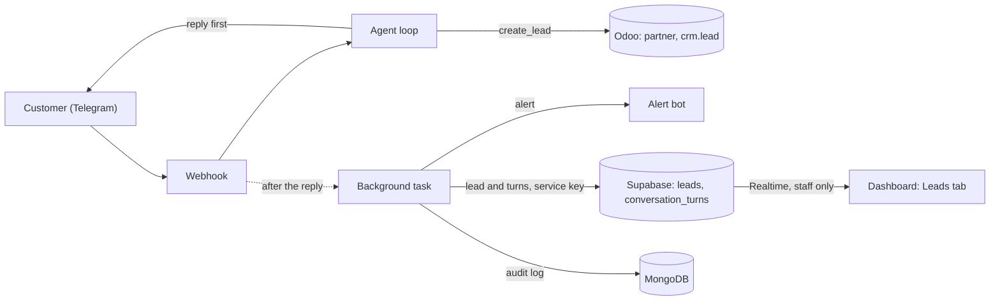

# Architecture

## Data flow

```mermaid
flowchart LR
    subgraph Customer
        TG[Telegram customer chat]
    end

    subgraph Engine["engine/ (FastAPI, uvicorn)"]
        WH["/webhook/telegram<br/>secret-token check, rate limit,<br/>retry dedupe, input screening"]
        LOOP["agent_loop.run_turn()<br/>domain-agnostic tool-calling loop"]
        LLM["LLMClient<br/>OpenRouter / Mistral"]
        ADAPT["DomainAdapter<br/>cars.py or real_estate.py<br/>(the only domain-specific code)"]
        WH --> LOOP
        LOOP --> LLM
        LLM -- tool call --> LOOP
        LOOP --> ADAPT
    end

    subgraph Odoo["Odoo 18 (leadgate DB)"]
        CATALOG["leadgate.catalog.item<br/>(cars + real_estate rows)"]
        LEAD["crm.lead"]
        AUTOACT["Automated Action:<br/>on catalog_item status write<br/>calls _notify_webhook()"]
    end

    subgraph N8N["n8n workflow: odoo-sync"]
        WEBHOOK_TRIGGER["Webhook Trigger"]
        SUPA_UPSERT["Upsert Supabase<br/>catalog_items"]
        MONGO_INSERT["Insert MongoDB<br/>catalog_events"]
        WEBHOOK_TRIGGER --> SUPA_UPSERT
        WEBHOOK_TRIGGER --> MONGO_INSERT
    end

    SUPABASE[("Supabase<br/>public.catalog_items<br/>(structured mirror)")]
    MONGODB[("MongoDB<br/>leadgate.catalog_events<br/>(unstructured audit log)")]
    DASH["React dashboard<br/>Supabase Realtime subscription"]

    TG <--> WH
    ADAPT -- search_read / create --> CATALOG
    ADAPT -- create --> LEAD
    CATALOG -- status changes --> AUTOACT
    AUTOACT -- HTTP POST --> WEBHOOK_TRIGGER
    SUPA_UPSERT --> SUPABASE
    MONGO_INSERT --> MONGODB
    SUPABASE -- Realtime --> DASH
```

## The lead path

A lead goes through five steps. Only the Odoo step and the reply are on the request path;
everything after the reply is best-effort, so a fault there cannot lose the lead or delay
the customer.

1. **Odoo.** The lead tool finds or creates the partner from the email or phone the customer
   typed, tags the lead, and returns the same lead if this customer asked for the same item
   a few minutes ago.
2. **The reply.** The customer's answer goes out before anything else.
3. **The background task.** After the reply, a background task alerts the owner, mirrors the
   lead and the conversation turn to Supabase, and writes the MongoDB audit log. It runs
   off the request path, so a slow Telegram or Supabase cannot hold up the next customer.
4. **If the turn fails halfway.** Tool calls are reported as they finish. If the model fails
   after a lead was created, the owner is still alerted, the customer is told to resend, and
   the resend returns the same lead.
5. **The dashboard.** The Leads tab reads the two Supabase tables. Row level security lets
   only staff accounts read them, and new rows arrive over Realtime.

## What each piece actually does

**Telegram to engine.** Telegram delivers updates to `POST /webhook/telegram`. The
handler checks `X-Telegram-Bot-Api-Secret-Token` with a constant-time comparison before
touching the request body, applies a per-`chat_id` rate limit (10 requests / 60s),
ignores an `update_id` it has already processed (Telegram redelivers unacknowledged
updates), strips control characters and chat-template tokens from the text, caps its
length (2000 characters), and turns away messages that match known injection phrasings
before any LLM call is made. Everything else goes to the agent loop.

**Agent loop, adapter, Odoo.** `engine/core/agent_loop.py` is the entire decision
engine, and it has never seen the word "car" or "bedroom." It injects a domain-agnostic
system prompt, sends the conversation plus whatever tool schemas the active adapter
declares to the LLM, executes any tool call the model makes by calling
`adapter.execute_tool(...)`, and, if the model called a tool, makes a second LLM call to
turn the raw tool result into a grounded natural-language reply. `CarsAdapter` and
`RealEstateAdapter` are the only two files that know their domain's vocabulary; each is
about 40 lines translating a tool call into an Odoo `search_read` domain filter or a
`crm.lead` create. Both read and write through `leadgate.catalog.item`, a single
domain-agnostic model (`odoo/addons/leadgate_domain/models/catalog_item.py`) with a
`domain_type` selection field distinguishing `cars` from `real_estate` rows.

**Guardrails.** `engine/core/guardrails.py` sits around the agent loop and, like the loop,
knows nothing about cars or property. Each tool argument the model produces is checked
against that tool's own JSON schema before an adapter sees it: unknown keys dropped,
numbers coerced and range-checked, strings trimmed to one line and length-capped, enums
enforced. A turn executes at most three tool calls, `create_lead` is limited to three per
chat per hour, and a lead's price is only recorded when a catalog item really has it. The
final reply has links removed and is replaced outright if it repeats a chunk of the system
prompt. The system prompt itself tells the model to treat customer text and tool results
as data. `eval/run_redteam.py` attacks all of this with 26 adversarial messages and checks
the outcome deterministically.

**Conversation memory.** The last 20 turns of each chat live in an in-memory cache limited
to 1000 chats (least recently used out). The durable copy is the MongoDB `conversations`
collection the engine already writes to: when a chat is not in the cache, for example
after a restart, its recent turns are read back from MongoDB before the reply is
generated. Turns that the injection screen blocked are never replayed.

**Odoo to n8n.** Odoo doesn't push to Supabase or MongoDB directly. A `base.automation`
rule watches `leadgate.catalog.item`'s `status` field for writes and calls
`_notify_webhook()`, which POSTs `{id, domain_type, status, name, price}` as JSON to a
URL stored in the `leadgate.sync_webhook_url` system parameter (pointed at n8n's
container hostname, since the POST originates inside the Odoo container). If that
parameter is unset, the call is a silent no-op. A webhook delivery failure never blocks
the record write that triggered it.

**n8n to Supabase and MongoDB.** One n8n workflow (`n8n/workflows/odoo-sync.json`), one
webhook trigger, two independent branches, each with `onError: continueRegularOutput` so
a failure in one branch can never take down the other. The Supabase branch upserts into
`public.catalog_items` on `odoo_id` conflict (`Prefer: resolution=merge-duplicates`),
keeping one current row per catalog item. The MongoDB branch inserts a new document into
`leadgate.catalog_events` on every status change, so nothing is ever overwritten there.

**Supabase to dashboard.** The React dashboard (`dashboard/`) does an initial fetch of
`catalog_items` and then subscribes to Postgres changes over Supabase Realtime, so the
live-leads feed and per-domain status counts update within a second or two of a real
change in Odoo, with no polling.

## Why two databases

This isn't two databases for scalability as a box to check. They serve different jobs.
Supabase's `catalog_items` table is a structured, current-state mirror: exactly one row
per catalog item, upserted in place, with a schema (`bigint`, `numeric(12,2)`,
`timestamptz`) built specifically so the dashboard's Realtime subscription and status
counts can query it directly with no transformation. It answers "what does this item
look like right now."

MongoDB's `catalog_events` collection does the opposite job by design: an append-only,
unstructured audit log. Every status transition lands as a new document carrying the
full raw webhook payload. Nothing is ever updated or merged, and the schema is whatever
Odoo happened to send that day. It answers "what happened, in what order, with what
payload," a question a structured mirror can't answer once it's overwritten a row.
Forcing both jobs onto one database would mean either losing history (a mirror-only
design) or making the live dashboard query an ever-growing, unindexed event stream on
every render (an events-only design). Splitting them means each store is shaped for the
one thing it's actually good at.
