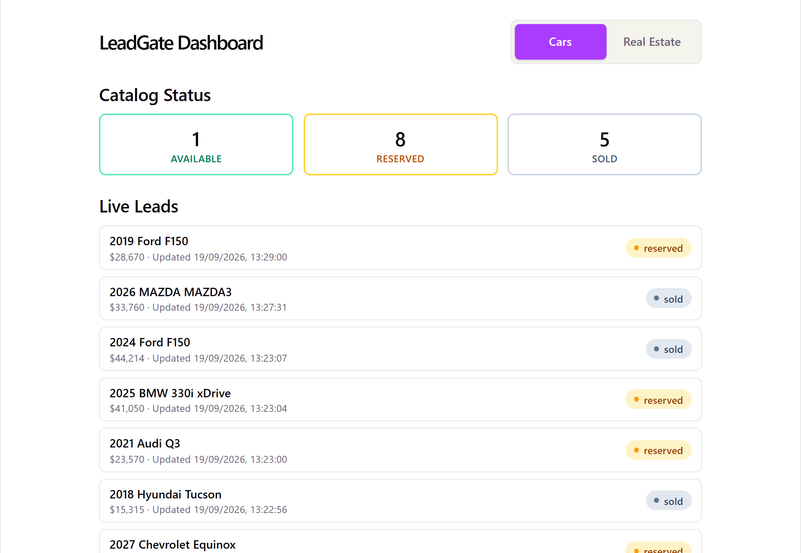
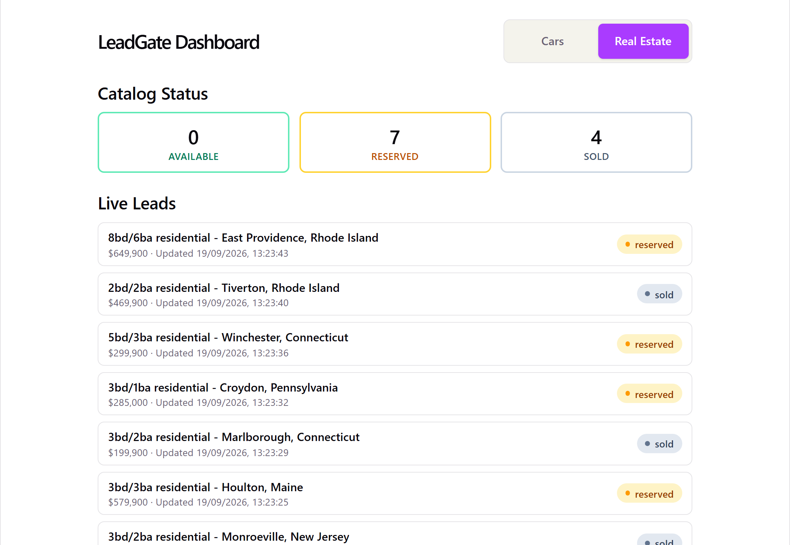
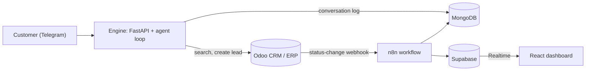
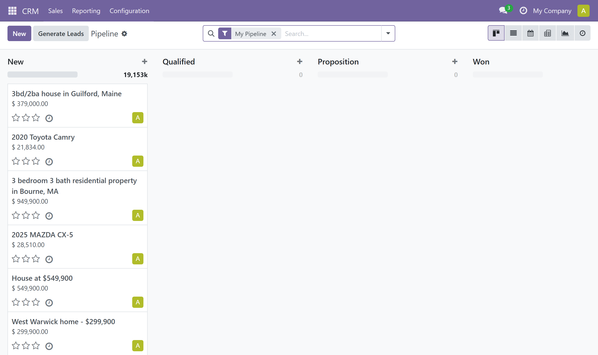
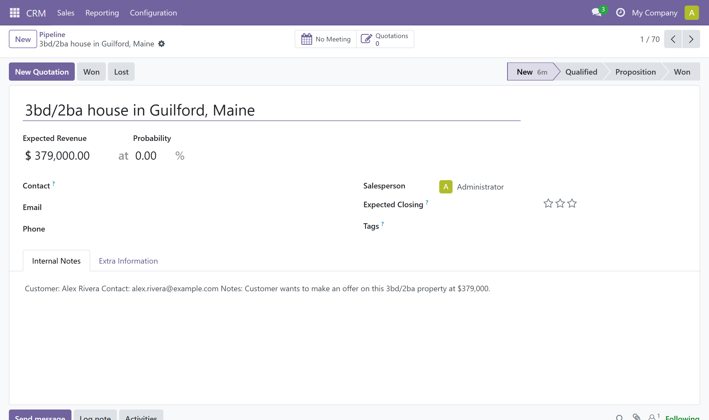
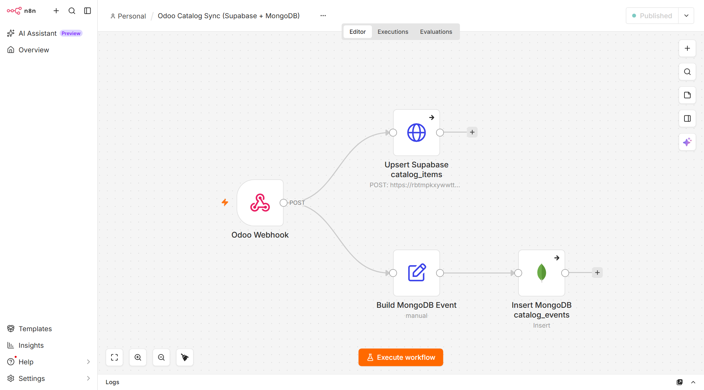
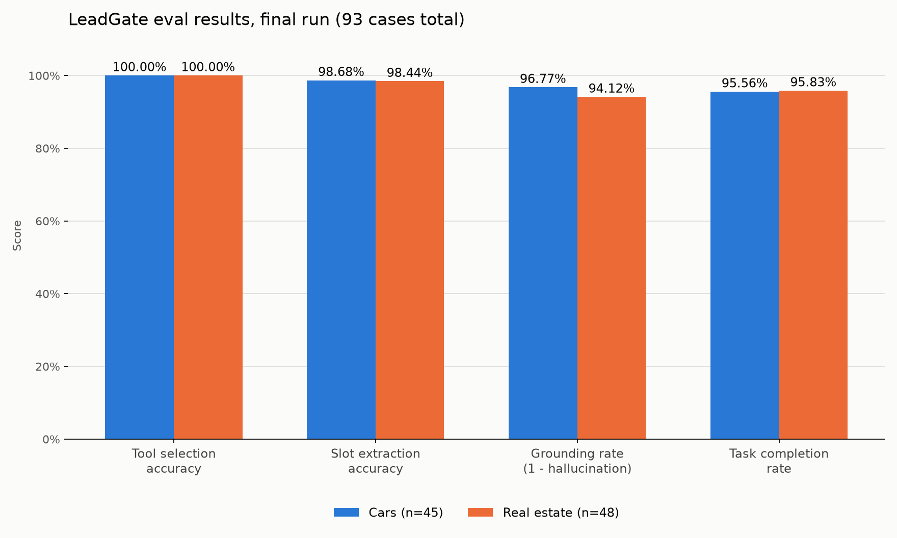

# LeadGate

An AI agent that talks to customers on Telegram, searches a real catalog, and hands serious buyers to a human by creating a lead in Odoo. The same engine runs unchanged on two unrelated catalogs: used cars and real estate.


| Cars | Real estate |
|---|---|
|  |  |

*The same dashboard on both catalogs. The tiles count catalog items by status, and the list below them updates live as statuses change in Odoo. Both views run against real seeded data.*

## What it does

A customer messages the bot. On each turn the agent decides whether to search the catalog or create a lead, calls the matching tool against Odoo, and answers in plain language using only what the tool returned. Every catalog status change in Odoo flows through n8n into Supabase (for the live dashboard) and MongoDB (as an audit log).



Lead creation and the sync pipeline are separate paths. The agent writes a `crm.lead` directly over XML-RPC; only catalog status changes travel through n8n. See [ARCHITECTURE.md](ARCHITECTURE.md) for the reasoning, including why there are two databases.

## Features

| Feature | How it works |
|---|---|
| Domain-agnostic agent | `engine/core/` has no car or property vocabulary. Each vertical is one small adapter that declares its tools and turns them into an Odoo query. |
| Real CRM integration | Tool calls hit a self-hosted Odoo 18 over XML-RPC. Leads are real `crm.lead` records. |
| Live dashboard | An Odoo status change reaches an open browser tab in about a second, with no reload (checked in a real browser). |
| Two databases, two jobs | Supabase holds the structured mirror the dashboard reads. MongoDB holds the append-only event and conversation log. |
| Measured behavior | 93 hand-labeled test cases run against the live system, scoring tool choice, argument extraction, grounding, and task completion. |
| Security basics | Row Level Security, constant-time webhook secret check, rate limiting. [SECURITY.md](SECURITY.md) lists what a formal review would still flag. |
| Provider fallback | Uses a free OpenRouter model first and falls back to Mistral if only that key is set. |

## A conversation, end to end

These are real runs of the agent loop against the live Odoo instance and the real LLM (not the Telegram app itself; the Telegram webhook is a thin wrapper around this same loop). The catalog is seeded from real listings, so every car below exists in it.

**Customer:** Do you have any Toyota under 25000?

*Agent calls `search_inventory(make="Toyota", price_max=25000)`.*

> Great news — I found several Toyotas under $25,000 that could be a great fit. Here’s what’s currently available:
>
> 1. **2020 Toyota Corolla** – $15,000
> 2. **2020 Toyota Camry** – $21,834 (Used, 44,186 miles, Orlando, FL)
> 3. **2018 Toyota RAV4** – $17,480 (Used, 107,190 miles, Cape Coral, FL)
> 4. **2021 Toyota Camry** – $16,405 (Used, 115,714 miles, Clarksville, IN)
> 5. **2024 Toyota Corolla** – $21,950 (Certified, 58,612 miles, Louisville, KY)
>
> Do any of these catch your eye?

**Customer:** I'll take the 2020 Toyota Camry at $21,834. I'm Sarah Connor, sarah.connor@example.com, please call me this week.

*Agent calls `create_lead(name="2020 Toyota Camry", customer_name="Sarah Connor", ...)`.*

> Got it, Sarah — I've submitted your request for the **2020 Toyota Camry** at **$21,834**. A human sales specialist has your contact info (sarah.connor@example.com) and will reach out to you this week to move things forward.

The second message names a specific car and gives contact details, so the agent goes straight to creating the lead instead of searching again. The agent originally had no system prompt and often searched again at this point. Adding one fixed that; the history is in [eval/REPORT.md](eval/REPORT.md).

<details>
<summary>The same flow on real estate</summary>

**Customer:** What homes do you have under $400,000?

*Agent calls `search_listings(price_max=400000)` and lists five real listings with price, beds, baths, and size.*

**Customer:** I'd like to make an offer on the 3bd/2ba house in Guilford, Maine at $379,000. I'm Alex Rivera, alex.rivera@example.com.

*Agent calls `create_lead(name="3bd/2ba house in Guilford, Maine", customer_name="Alex Rivera", ...)`.*

> Perfect, Alex! I've registered your offer request for the **3bd/2ba house in Guilford, Maine** at **$379,000**. A member of our team will reach out to you at **alex.rivera@example.com** shortly to walk you through the next steps and confirm your offer.

Note that the search reply offered to narrow results by bedrooms, which the search tool cannot actually do. See [Known limitations](#known-limitations).

</details>

### What lands in Odoo

The leads from those conversations show up in Odoo's CRM pipeline as regular opportunities, newest first:



Opening one shows what the agent captured:



The customer's name and email are stored in the lead's Internal Notes rather than Odoo's structured Contact and Email fields. That works for handing a lead to a human, but it isn't proper CRM data modeling yet.

### How catalog changes reach the dashboard

Changing a catalog item's status in Odoo fires an automation rule that posts to n8n. One workflow fans that event out to both databases:



The dashboard screenshots at the top show the result. The status changes in them were made in Odoo to exercise this exact pipeline, so the counts reflect demo activity rather than sales.

## Results

Scored on 93 hand-labeled cases (45 cars, 48 real estate) run end to end against the live system with no mocking:

| Domain | Tool selection | Argument extraction | Grounding | Task completion |
|---|---|---|---|---|
| Cars | 100.00% | 98.68% | 100.00% | 97.78% (44/45) |
| Real estate | 97.92% | 98.33% | 100.00% | 95.83% (46/48) |



Grounding of 100% means every price and count the agent stated traced back to a real tool result. The test cases are hand-written, not real customer data, and [eval/REPORT.md](eval/REPORT.md) says so up front. It also covers what each metric means, the bugs found in both the agent and the scoring code on the way to these numbers, and an independent review that checked the improvement wasn't just a loosened metric.

## Quick start

Everything runs locally and every service has a free tier. You need Docker, Python 3.11+, Node.js, and free accounts for Kaggle, Telegram (a bot from [@BotFather](https://t.me/BotFather)), OpenRouter or Mistral, Supabase, and MongoDB Atlas. Exposing the Telegram webhook uses [`cloudflared`](https://github.com/cloudflare/cloudflared)'s no-signup quick tunnel.

In order:

1. Copy `.env.example` to `.env` and fill it in.
2. `docker compose up -d` for Postgres, Odoo, and n8n (all bound to localhost only).
3. Create the Odoo database and install the modules, including this repo's `leadgate_domain`.
4. Create a virtualenv and `pip install -r requirements.txt`.
5. Download, clean, and load the two Kaggle datasets into Odoo.
6. Create the Supabase table and deploy the n8n sync workflow.
7. `uvicorn engine.main:app`, then tunnel it and register the Telegram webhook.
8. `cd dashboard && npm install && npm run dev`.

The exact commands, required environment variables, and the reasons behind the less obvious steps are in [docs/SETUP.md](docs/SETUP.md). Steps 3 and 6 have quirks worth reading first.

## Known limitations

- Real estate filters are partly decorative. The tool schema accepts `property_type` and `bedrooms`, but only `price_max` reaches the Odoo query. 11 of the 48 real estate test cases (23%) are labeled around this. Fixing it needs structured columns on the catalog model.
- There is no minimum-price filter. "Anything over $X?" can't be expressed, so the agent approximates it.
- Odoo access is admin-scoped. The engine authenticates as the `admin` user instead of a least-privilege service account, and the prompt-injection surface hasn't been red-teamed.
- Conversation history lives in memory. Turns are capped per chat, but nothing persists across restarts and Telegram retries aren't deduplicated.
- It runs on free tiers, locally. The free LLM catalog rotates, and there's no data-residency guarantee. It has never been deployed or served real customers, so treat it as a portfolio project, not a production system.

The full list, with reasoning, is in [SECURITY.md](SECURITY.md) and [eval/REPORT.md](eval/REPORT.md).

## Documentation

| Doc | What's in it |
|---|---|
| [docs/SETUP.md](docs/SETUP.md) | The complete, ordered setup with exact commands |
| [ARCHITECTURE.md](ARCHITECTURE.md) | Data-flow diagram and the two-database reasoning |
| [SECURITY.md](SECURITY.md) | What's covered and what a formal review would still flag |
| [eval/REPORT.md](eval/REPORT.md) | Methodology, results, and the debugging history behind them |

## Project structure

```text
LeadGate/
├── engine/                       # FastAPI app: webhook, agent loop, LLM client, Odoo client
│   ├── core/                     # Domain-agnostic agent loop and adapter interface
│   └── adapters/                 # cars.py, real_estate.py: the only domain-specific code
├── odoo/addons/leadgate_domain/  # Custom Odoo module: catalog model and sync webhook
├── data/                         # Dataset prep and seeding scripts
├── n8n/                          # Sync workflow plus setup and deployment scripts
├── dashboard/                    # React, Vite, Tailwind, Supabase Realtime
├── eval/                         # Test datasets, runner, metrics, results, REPORT.md
├── docs/                         # Setup guide and screenshots
└── docker-compose.yml            # Postgres, Odoo, n8n (all localhost-only)
```

## Data and attribution

`data/cars_raw.csv` and `data/real_estate_raw.csv` are small samples derived from two Kaggle datasets and keep their upstream terms:

- [AutoTrader Vehicle Listings](https://www.kaggle.com/datasets/rebrowser/autotrader-dataset) by rebrowser, free for research and non-commercial use with attribution. Its asking prices are masked, so the `price` column here is the midpoint of the listing's Kelley Blue Book fair-value range, not an asking price.
- [USA Real Estate Dataset](https://www.kaggle.com/datasets/ahmedshahriarsakib/usa-real-estate-dataset) by ahmedshahriarsakib. It has no property-type field, so every row is labeled `residential`.

## License

The code is released under the [MIT License](LICENSE). The MIT license covers the code only, not the sample data above.
