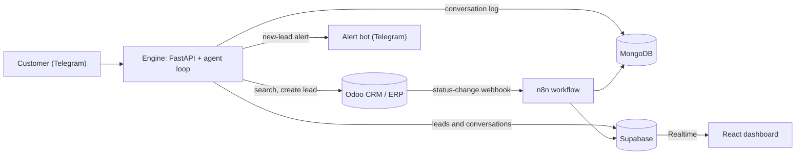

# LeadGate

An AI agent that talks to customers on Telegram, searches a real catalog, and hands serious buyers to a person by creating a lead in Odoo. The same engine runs on two unrelated catalogs: used cars and real estate.


*The dashboard is a board of keys, one per catalog item. A key flipped up is on hold, and an empty hook is sold.*

## See it work


*About 110 seconds, real services throughout. A customer asks for a certified Toyota and then for a hold on the cheapest one. The owner's alert arrives in Telegram with buttons, the owner replies and taps Mark sold, the key leaves its hook, and Odoo shows the lead as Won. The customer's side of Telegram is simulated. [Watch the full-quality video](docs/demo/leadgate-demo.mp4).*

## How it works

A customer messages the bot. On each turn the agent decides whether to search the catalog or create a lead, calls the matching tool against Odoo, and answers using only what the tool returned. Leads are written straight to Odoo, and the owner is alerted through a separate bot. Catalog status changes in Odoo go through n8n into Supabase (for the live dashboard) and MongoDB (as an audit log). [ARCHITECTURE.md](ARCHITECTURE.md) explains why there are two databases.



## Quick start

Everything runs locally and every service has a free tier. You need Docker, Python 3.11+, Node.js, and free accounts for Kaggle, Telegram (a bot from [@BotFather](https://t.me/BotFather)), OpenRouter or Mistral, Supabase, and MongoDB Atlas. The Telegram webhook is exposed with [`cloudflared`](https://github.com/cloudflare/cloudflared)'s no-signup quick tunnel.

1. Copy `.env.example` to `.env` and fill it in.
2. `docker compose up -d` starts Postgres, Odoo, and n8n, all bound to localhost.
3. Create the Odoo database and install the modules, including this repo's `leadgate_domain`.
4. Create a virtualenv and run `pip install -r requirements.txt`.
5. Download, clean, and load the two Kaggle datasets into Odoo.
6. Create the Supabase tables, deploy the n8n sync workflow, backfill the catalog, and create your staff login. Optionally create the alert bot and register its webhook.
7. Run `uvicorn engine.main:app`, then tunnel it and register the Telegram webhook. Then open your bot in Telegram and [try it](#using-it-on-telegram).
8. Run `cd dashboard && npm install && npm run dev`.

[docs/SETUP.md](docs/SETUP.md) has the exact commands and the environment variables. Read its notes on steps 3 and 6 first.

## Features

| Feature | How it works |
|---|---|
| Domain-agnostic agent | `engine/core/` has no car or property vocabulary. Each catalog is one small adapter that declares its tools and turns them into an Odoo query. |
| Search | Cars filter by make, model, price, year, mileage, condition and location, and sort by price, mileage or year. Real estate filters by price. |
| Real CRM integration | A lead is a real `crm.lead` with a linked contact, a Telegram source and a catalog tag. It is assigned to a salesperson with a call due the next day. Asking again about the same item within minutes returns the same lead. |
| Owner alerts | A separate Telegram bot tells the owner when a lead is created. Buttons take it, mark it contacted, win it or lose it. Replying to an alert writes to the customer, and `/talk` sends everything you type to one customer until `/back`. Customers with a public username get an Open chat link, and the others are asked once for a phone number. An untouched lead gets one reminder. |
| Holds and viewings | A customer can ask for a 24 hour hold or a viewing on a day they choose. Both are requests: the owner confirms or releases them from Telegram, and a hold moves the key on the dashboard. |
| Live dashboard | An Odoo status change reaches an open browser tab in about a second. A staff-only Leads tab shows each lead with the conversation behind it. It works on a phone and by keyboard. |
| Two databases | Supabase holds the structured mirror the dashboard reads. MongoDB holds the append-only event log and the chat history, so a restart keeps the last 20 turns of each chat. |
| Model fallback | An ordered list of free OpenRouter models, then Mistral. A model that fails is skipped for ten minutes. `OPENROUTER_MODELS` in `.env` sets your own list. |

## Using it on Telegram

There are two bots. The customer bot is the one people talk to. The alert bot is private and only the owner uses it.

**As a customer.** Open the customer bot (the username you picked in BotFather), press Start, and write in plain language. There are no commands to learn. You can:

- Browse and narrow down the catalog, for example "certified Toyotas under 30000 with under 60000 miles, cheapest first".
- Ask for a hold on an item for 24 hours, or for a viewing on a day you choose. The assistant asks for a day and a time of day if you leave them out.
- Give your name and an email or phone number and say you want an item. That creates a lead for a person to follow up.

The assistant only handles the catalog. It declines anything else, never sends links, and never promises a hold or a viewing, because the owner confirms those. If you have no public Telegram username, it asks once for a phone number. You can tap the share button or type the number. When the owner replies, the assistant stays quiet in your chat until the owner hands it back.

**As the owner.** Create a second bot in BotFather, send it `/start` (a bot can only message someone who has messaged it first), and put its token and your chat id in `.env`. [docs/SETUP.md](docs/SETUP.md) has the steps. Each new lead then arrives as a message with buttons:

| Control | What it does |
|---|---|
| Take it, Contacted, Lost | Assign the lead to you, close the call task and move it to Qualified, or archive it |
| Mark sold, Release hold | On a hold alert: win the lead and take the key off the board, or put the item back |
| Confirm viewing | On a viewing alert: tells the customer the day and time of day |
| Reply, Talk here | Write to the customer, or start a chat where everything you type goes to them |
| Open chat | If the customer has a public username, opens their profile |
| `/talk 71`, `/back`, `/open`, `/help` | Start a chat with lead 71, hand the chat back to the assistant, list leads still waiting, show this list |

## A short example

**Customer:** Do you have any Toyota under 25000?

*The agent calls `search_inventory(make="Toyota", price_max=25000)` and lists five cars with price, mileage and location.*

**Customer:** I'll take the 2020 Toyota Camry at $21,834. I'm Sarah Connor, sarah.connor@example.com, please call me this week.

*The agent calls `create_lead(name="2020 Toyota Camry", customer_name="Sarah Connor", ...)`.*

> Got it, Sarah — I've submitted your request for the **2020 Toyota Camry** at **$21,834**. A human sales specialist has your contact info (sarah.connor@example.com) and will reach out to you this week to move things forward.

These are real runs of the agent loop against live Odoo and the real model. The lead lands in Odoo's pipeline as a regular opportunity, with a real contact and a price the catalog actually has:


The owner sees it on the dashboard's Leads tab, with the conversation printed beside it:


[docs/WALKTHROUGH.md](docs/WALKTHROUGH.md) covers the rest: the real estate flow, filters and memory across a restart, the owner's alert and buttons, talk mode, holds, and how catalog changes reach the dashboard.

## Safety

Anyone can message a public bot, so the limits live in code and do not depend on the model behaving. That covers input screening, schema-checked tool calls, prices checked against the catalog, per-chat limits, link-free replies, and an owner channel that only accepts the owner's chat.

Prompt injection cannot be fully solved. At worst, a hijacked assistant can place one lead, hold or viewing per message, and three an hour per chat, on items that exist and at their catalog price. A person confirms each one. It cannot change an existing lead, reach the owner's controls, or mark anything sold. In one red-team case a customer asked for a Camry for $1. The lead is created, the made-up price is dropped because no catalog item has it, and the lead is flagged "Price unverified". With the guardrails off, the same message produced a bot that confirmed a $1 lead.

[SECURITY.md](SECURITY.md) has the full list of protections and what is still open.

## Results

Scored on 93 hand-labeled cases (45 cars, 48 real estate) run end to end against the live system, with no mocking.

| Domain | Tool selection | Argument extraction | Grounding | Task completion |
|---|---|---|---|---|
| Cars | 100.00% | 100.00% | 100.00% | 100.00% (45/45) |
| Real estate | 97.92% | 96.67% | 100.00% | 93.75% (45/48) |

Grounding is the share of replies where every price the agent stated traced back to a tool result. The test cases are hand-written, not real customer data. They were scored on a free model that OpenRouter has since retired. The engine now defaults to other free models and has not been re-scored on them, and free models vary by a few cases from run to run, so read the last digit as noise.

38 hand-written attacks were sent through the real webhook, model and Odoo reads, and the pass criteria are string and structure checks, not an LLM judge.

| Run | Passed |
|---|---|
| With guardrails | 38 of 38 |
| Every guardrail and the prompt's safety section off | 26 of 38 |

The test suite has 713 engine tests, 32 dashboard tests and 44 browser checks. It also has live scripts against real Odoo, Supabase and the model. [eval/REPORT.md](eval/REPORT.md) covers the methodology, what each metric means, the bugs found along the way, and the red-team run in detail.

## Documentation

| Doc | What's in it |
|---|---|
| [docs/SETUP.md](docs/SETUP.md) | The complete, ordered setup with exact commands |
| [docs/WALKTHROUGH.md](docs/WALKTHROUGH.md) | A tour from the customer's first message to the owner's buttons |
| [docs/demo/](docs/demo/) | The demo (about 110 seconds) as an MP4 and a GIF |
| [dashboard/README.md](dashboard/README.md) | How the key board works, and how to run and use it |
| [ARCHITECTURE.md](ARCHITECTURE.md) | Data-flow diagram and the two-database reasoning |
| [SECURITY.md](SECURITY.md) | Protections, how they were tested, and what a formal review would check |
| [eval/REPORT.md](eval/REPORT.md) | Methodology, results, and the debugging history behind them |

## Project structure

```text
LeadGate/
├── engine/                       # FastAPI app: webhook, agent loop, LLM client, Odoo client
│   ├── core/                     # Domain-agnostic agent loop, guardrails, contact handling, adapter interface
│   ├── adapters/                 # cars.py, real_estate.py: the only domain-specific code
│   ├── notifier.py               # Owner alerts and buttons through the second Telegram bot
│   ├── owner_bot.py              # What the owner's buttons and replies do; talk mode; human mode
│   ├── contact_share.py          # Asks a customer with no username for a phone number and uses it
│   ├── sweeper.py                # Reminds the owner about untouched leads
│   ├── store.py                  # Which chat a lead came from; human-mode state
│   └── supabase_sync.py          # Copies leads, statuses and conversations to Supabase
├── odoo/addons/leadgate_domain/  # Custom Odoo module: catalog model and sync webhook
├── data/                         # Dataset prep and seeding scripts
├── n8n/                          # Sync workflow, setup and deployment scripts, and the access-control check
├── dashboard/                    # React, Vite, Tailwind, Supabase Realtime
├── eval/                         # Test datasets, eval and red-team runners, metrics, results, REPORT.md
├── docs/                         # Setup guide, walkthrough, screenshots and the demo video
├── .github/workflows/            # Deploys the dashboard to GitHub Pages
└── docker-compose.yml            # Postgres, Odoo, n8n (all localhost-only)
```

## Data and attribution

`data/cars_raw.csv` and `data/real_estate_raw.csv` are small samples derived from two Kaggle datasets and keep their upstream terms:

- [AutoTrader Vehicle Listings](https://www.kaggle.com/datasets/rebrowser/autotrader-dataset) by rebrowser, free for research and non-commercial use with attribution. Its asking prices are masked, so the `price` column here is the midpoint of the listing's Kelley Blue Book fair-value range, not an asking price.
- [USA Real Estate Dataset](https://www.kaggle.com/datasets/ahmedshahriarsakib/usa-real-estate-dataset) by ahmedshahriarsakib. It has no property-type field, so every row is labeled `residential`.

## License

The code is released under the [MIT License](LICENSE). The MIT license covers the code only, not the sample data above.
