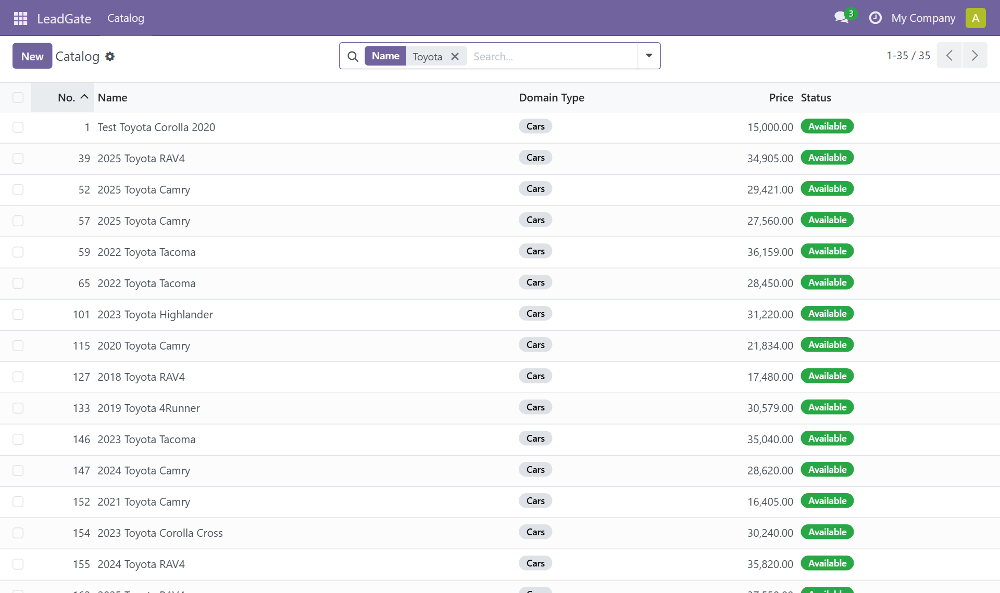
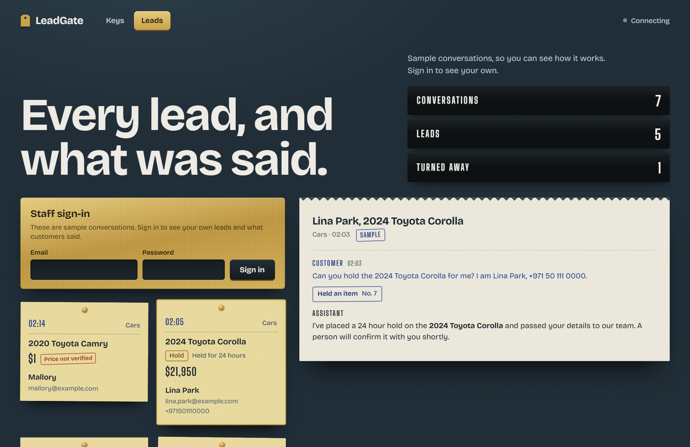
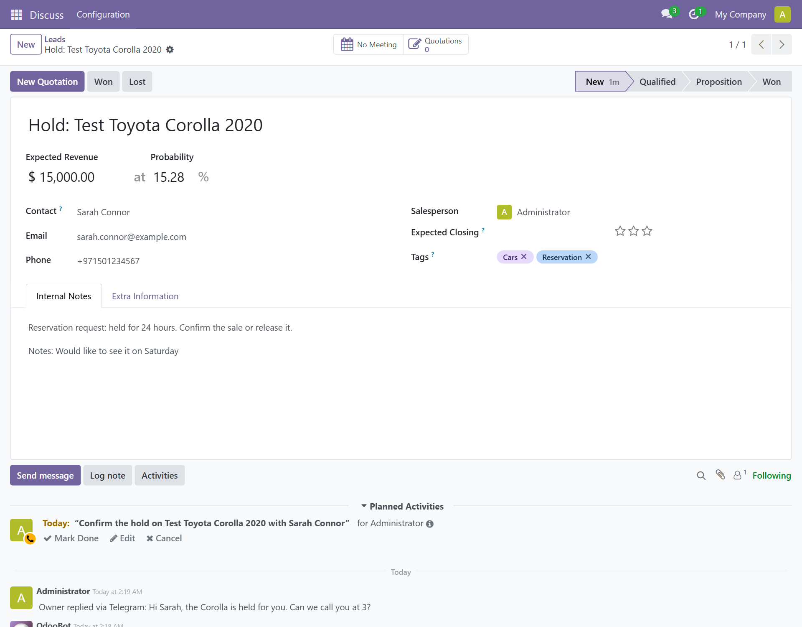
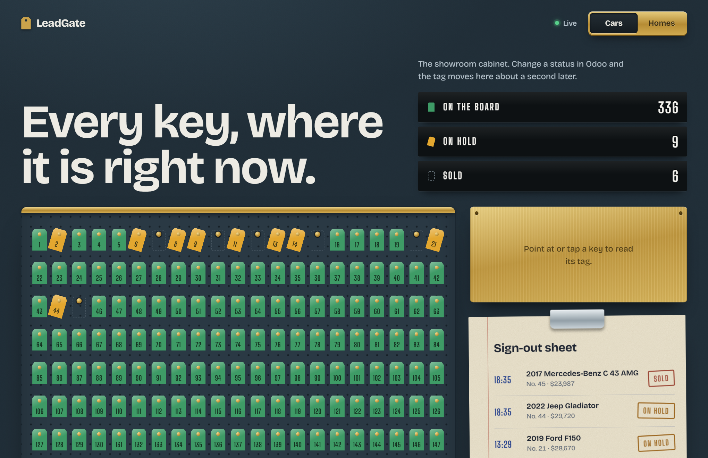
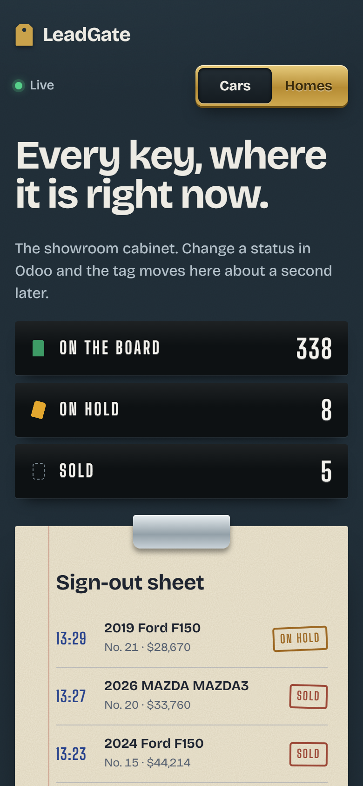
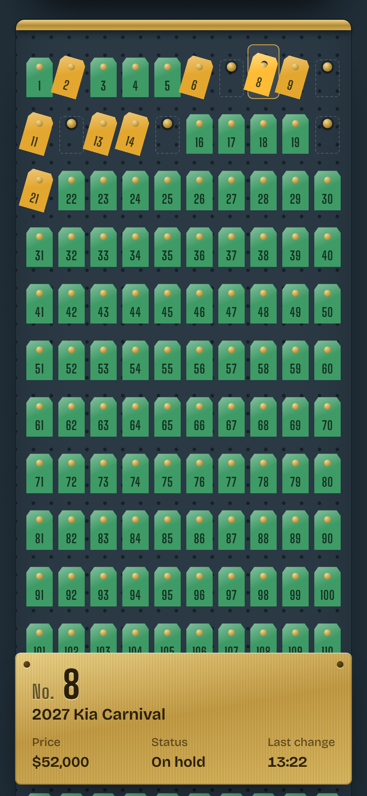

# Walkthrough

A tour of what LeadGate does, in the order a customer and an owner meet it: the conversation, what lands in Odoo, the owner's alert, what happens after the lead, and how catalog changes reach the dashboard. The [README](../README.md) has the short version.

## A conversation, end to end

These are real runs of the agent loop against the live Odoo instance and the real LLM (not the Telegram app itself; the Telegram webhook is a thin wrapper around this same loop). The catalog is seeded from real listings, so every car below exists in it.

**Customer:** Do you have any Toyota under 25000?

*Agent calls `search_inventory(make="Toyota", price_max=25000)`.*

> Great news — I found several Toyotas under $25,000 that could be a great fit. Here’s what’s currently available:
>
> 1. **2020 Toyota Corolla** – $15,000
> 2. **2020 Toyota Camry** – $21,834 (Used, 44,186 miles, Orlando, FL)
> 3. **2018 Toyota RAV4** – $17,480 (Used, 107,190 miles, Cape Coral, FL)
> 4. **2021 Toyota Camry** – $16,405 (Used, 115,714 miles, Clarksville, IN)
> 5. **2024 Toyota Corolla** – $21,950 (Certified, 58,612 miles, Louisville, KY)
>
> Do any of these catch your eye?

**Customer:** I'll take the 2020 Toyota Camry at $21,834. I'm Sarah Connor, sarah.connor@example.com, please call me this week.

*Agent calls `create_lead(name="2020 Toyota Camry", customer_name="Sarah Connor", ...)`.*

> Got it, Sarah — I've submitted your request for the **2020 Toyota Camry** at **$21,834**. A human sales specialist has your contact info (sarah.connor@example.com) and will reach out to you this week to move things forward.

The second message names a specific car and gives contact details, so the agent goes straight to creating the lead instead of searching again. The agent originally had no system prompt and often searched again at this point. Adding one fixed that; the history is in [eval/REPORT.md](../eval/REPORT.md).

The same flow on real estate

**Customer:** What homes do you have under $400,000?

*Agent calls `search_listings(price_max=400000)` and lists five real listings with price, beds, baths, and size.*

**Customer:** I'd like to make an offer on the 3bd/2ba house in Guilford, Maine at $379,000. I'm Alex Rivera, alex.rivera@example.com.

*Agent calls `create_lead(name="3bd/2ba house in Guilford, Maine", customer_name="Alex Rivera", ...)`.*

> Perfect, Alex! I've registered your offer request for the **3bd/2ba house in Guilford, Maine** at **$379,000**. A member of our team will reach out to you at **alex.rivera@example.com** shortly to walk you through the next steps and confirm your offer.

## Filters, and memory across a restart

**Customer:** Show me certified Toyotas under 30000 with under 60000 miles, cheapest first

*Agent calls `search_inventory` with the make, condition, price, mileage and sort filters.*

> I found 3 certified Toyotas that match your criteria (under $30,000 and under 60,000 miles), sorted by price:
>
> 1. **2024 Toyota Corolla** – $21,950
>    - Mileage: 58,612
>    - Location: Louisville, KY
>
> 2. **2025 Toyota Corolla Cross** – $27,410
>    - Mileage: 20,850
>    - Location: Louisville, KY
>
> 3. **2024 Toyota Camry** – $28,620
>    - Mileage: 16,512
>    - Location: Florence, KY
>
> Would you like more details on any of these, or should I refine the search further?

The engine was then stopped and started again, so it had no memory of the chat in RAM. The next message arrived at the new process, which rebuilt the conversation from MongoDB:

**Customer:** Which of those has the lowest mileage, and where is it located?

> The car with the lowest mileage is the **2024 Toyota Camry** at **16,512 miles**, located in **Florence, KY**, priced at $28,620.
>
> For reference, here's the full lineup again:
>
> 1. **2024 Toyota Corolla** – 58,612 miles – $21,950 (Louisville, KY)
> 2. **2025 Toyota Corolla Cross** – 20,850 miles – $27,410 (Louisville, KY)
> 3. **2024 Toyota Camry** – **16,512 miles** – $28,620 (Florence, KY) ✅ Lowest mileage
>
> Would you like more information on the Camry, or help with anything else?

## What lands in Odoo

The leads from those conversations show up in Odoo's CRM pipeline as regular opportunities, newest first:

Opening one shows what the agent captured. The customer is a real contact with an email and a phone number, the lead is tagged by catalog, and the revenue is a price the catalog really has:

If a customer types a number and an email, both are kept, and a contact that is already in Odoo is reused. Contact text is treated as untrusted: emails are matched exactly, never with wildcards, and notes are escaped before they are written.

The catalog itself is manageable in Odoo too, under **LeadGate > Catalog**. Changing a status there is what moves a key on the dashboard:

## The lead alert and the Leads tab

When a lead is created the owner gets a message from a separate alert bot, so alerts never share a token or a chat with customers:

> **New lead** #79
> **2020 Toyota Camry**
> Sarah Connor
> sarah.connor@example.com · +971501234567
> $21,834
> Open in Odoo

Telegram answers every send with a receipt that includes a message id, and the engine logs any send that fails. If the alert bot is not set up, or Telegram is down, the lead and the customer's reply are not affected. The "Open in Odoo" link is tappable once `ODOO_PUBLIC_URL` is an address your phone can reach. Telegram does not turn `localhost` into a link.

The dashboard's Leads tab shows the same lead as a message slip, and the conversation behind it prints on a paper roll. The customer's words are in blue, the assistant's in black, and between them is a stamped note for each thing the assistant did. A lead whose price the customer made up is flagged on its slip. A hold or a viewing request has its own tag on the slip, and a stamp shows where the owner has taken it.

Leads and conversations hold customers' names, contact details and messages, so they are private. Only staff accounts can read them, and the database enforces that, not just the page. Anyone else, including a stranger who registers their own account, sees nothing. Signed-out visitors get the sample conversations above, labelled as samples.

## After the lead

A lead is the start of the work, so each one carries its next step. It is assigned to a salesperson in Odoo and gets a call task due the next day. If nobody has touched it after 30 minutes, the owner gets one reminder. Odoo holds the record of that reminder (a tag on the lead), so a restart cannot make it nag twice.

The owner can act from Telegram without opening Odoo. The buttons under an alert do this:

| Button | What it does |
|---|---|
| Take it | Assigns the lead to you and notes it in Odoo |
| Contacted | Closes the call task and moves the lead to Qualified |
| Lost | Archives the lead, and releases the item if it was a hold |
| Reply | Opens a reply box, described below |

A hold alert has "Mark sold" and "Release hold" instead. Marking it sold takes the key off the board and wins the lead. A viewing alert has "Confirm viewing", which tells the customer the day and time of day.

Replying to an alert sends your text to the customer through the customer bot, logs it on the lead in Odoo, and puts that chat in human mode. In human mode the assistant stays quiet and the customer's messages come to you with Reply and "Hand back to bot" buttons, so you can answer by replying to them. `/back 71` or the button gives the chat back to the assistant, and it goes back by itself after six hours. `/open` lists the leads still waiting.

Replying to every message gets tedious, so there is a shorter way. Press "Talk here" under an alert, or send `/talk 71`, and from then on everything you type goes to that customer until you send `/back`. `/talk 72` switches to someone else. If you reply to a specific alert while talking to someone, that reply goes to the customer you replied to and the session stays where it was. `/talk` on its own says who you are talking to. A session ends after six hours, and every message you send keeps it going.

A customer with a public Telegram username also gets an "Open chat" button on their alert, which opens their profile so you can message them from your own account. Not everyone has a username, so the bot asks those customers once for a phone number, using Telegram's share-my-number button (they can type it instead). The number is added to the lead in Odoo and on the dashboard, and you get an alert with the number, a WhatsApp button and "Talk here". Telegram only treats a shared contact as genuine when it is the sender's own number, so a forwarded contact card is refused, and a number typed in a message is only used after the bot has asked for one.

The assistant can do two things beyond creating a lead. A customer can ask it to hold a car, or to arrange a viewing on a day they pick. A hold takes the key off the board for 24 hours, and a scheduled job in Odoo puts it back if nobody confirms it. A viewing becomes a meeting on the lead for that day. Both are requests that a person confirms, and the assistant is told not to promise either. Because a hold changes the catalog, it reaches the dashboard the same way an Odoo change does. The price on these leads always comes from the catalog, never from the model or the customer.

## How catalog changes reach the dashboard

Changing a catalog item's status in Odoo fires an automation rule that posts to n8n. One workflow fans that event out to both databases:

Here that pipeline is in action. Two statuses were changed in Odoo while the board was open: one car was put on hold and another was sold. Its tag left the hook, both tallies moved, and both changes were stamped onto the sheet.

The same board handles the second catalog, and it is built to be used on a phone. The sign-out sheet comes first, and the brass plate stays at the bottom of the screen while you scroll the wall.

| Homes | Phone |
|---|---|
|  |   |

The n8n workflow only mirrors an item when its status changes, so a new Supabase table starts empty. `n8n/scripts/backfill_supabase.py` copies the whole catalog across once.
